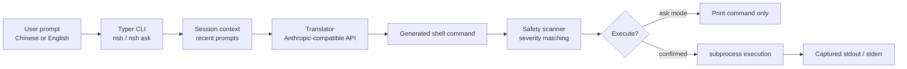

# nsh - Natural Shell

[](https://www.python.org/)
[](https://typer.tiangolo.com/)
[](https://rich.readthedocs.io/)
[](#license)

**nsh** is a Chinese-first command-line assistant that translates natural language into Ubuntu shell commands. It can preview generated commands, remember recent command context, detect dangerous patterns, and execute only after confirmation.

> Describe what you want in Chinese or English. nsh turns it into a shell command you can inspect before running.

## Highlights

- **Natural language to shell**: translate Chinese or English instructions into Ubuntu/Debian shell commands.
- **Safe by default**: generated commands are shown first and require confirmation before execution.
- **Danger detection**: risky patterns are grouped by severity and critical commands require double confirmation.
- **Context memory**: recent translations help resolve follow-up prompts such as "start it" after "install nginx".
- **Rich terminal output**: syntax-highlighted command previews, panels, tables, and status messages.
- **Configurable API backend**: uses the Anthropic Python SDK with an Anthropic-compatible endpoint.

## Table of Contents

- [How It Works](#how-it-works)
- [Requirements](#requirements)
- [Installation](#installation)
- [Configuration](#configuration)
- [Usage](#usage)
- [Safety Model](#safety-model)
- [Project Structure](#project-structure)
- [Development](#development)
- [Roadmap](#roadmap)
- [License](#license)

## How It Works



## Requirements

- Python 3.13+
- Ubuntu or Debian-compatible shell environment
- An Anthropic-compatible API key

## Installation

Clone the repository and install it in editable mode:

```bash
git clone https://github.com/CoolLiang1/Natural-Shell.git
cd Natural-Shell
pip install -e .
```

For development tools:

```bash
pip install -e ".[dev]"
```

## Configuration

nsh reads configuration from `~/.config/nsh/config.json`. The `ANTHROPIC_API_KEY` environment variable takes priority over the saved config value.

Set your API key with an environment variable:

```bash
export ANTHROPIC_API_KEY="sk-your-key-here"
```

Or store it in the nsh config file:

```bash
nsh config set api_key sk-your-key-here
```

Default config values:

```json
{
  "api_key": null,
  "base_url": "https://api.deepseek.com/anthropic",
  "model": "deepseek-v4-flash",
  "max_tokens": 500,
  "auto_execute": false,
  "safe_mode": true,
  "language": "zh"
}
```

Useful config commands:

```bash
nsh config get
nsh config get model
nsh config set model deepseek-v4-flash
nsh config set auto_execute false
nsh config path
nsh config reset
```

## Usage

### Translate Without Running

Use `nsh ask` when you only want to generate and inspect a command:

```bash
nsh ask "列出所有本周修改过的 PDF 文件"
nsh ask "find the 5 processes using the most CPU"
```

Example output:

```text
┏━━━━━━━━━━━━━━━━━━━━━ 生成的命令 ━━━━━━━━━━━━━━━━━━━━━┓
┃                                                        ┃
┃  find . -name "*.pdf" -mtime -7                        ┃
┃                                                        ┃
┗━━━━━━━━━━━━━━━━━━━━━━━━━━━━━━━━━━━━━━━━━━━━━━━━━━━━━━━━┛
```

### Translate and Run

Run `nsh` directly to generate, review, confirm, and execute:

```bash
nsh "安装 nginx"
nsh "启动 nginx"
```

The normal execution flow is:

```text
translate prompt -> show command -> confirm -> execute -> print output
```

You can skip the confirmation prompt when you already trust the command:

```bash
nsh --yes "列出当前目录最大的 10 个文件"
```

### Root Options

| Option | Description |
|---|---|
| `--yes`, `-y` | Skip confirmation and execute immediately. |
| `--model`, `-m` | Override the configured model for this request. |
| `--no-session` | Do not include recent session context. |
| `--interactive`, `-i` | Keep terminal control for commands such as `vim`, `less`, or interactive installers. |
| `--version`, `-V` | Print the installed nsh version. |

### Session History

nsh keeps the latest natural-language prompt and command pairs in `~/.config/nsh/session.json`, up to 10 entries.

```bash
nsh session
nsh session --clear
```

Example context flow:

```bash
nsh "安装 nginx"
# -> sudo apt install -y nginx

nsh "启动它"
# -> sudo systemctl start nginx
```

## Safety Model

nsh never executes generated commands by default. It first renders the command and asks for confirmation. If a command matches a known dangerous pattern, nsh displays a warning panel.

| Severity | Examples | Confirmation |
|---|---|---|
| LOW | `apt autoremove`, `docker system prune` | Standard confirmation |
| MEDIUM | `shutdown`, `reboot`, `killall` | Standard confirmation with warning |
| HIGH | `rm -rf *`, `curl \| bash`, `fdisk` | Standard confirmation with warning |
| CRITICAL | `rm -rf /`, `mkfs`, fork bombs, overwriting `/etc/passwd` | Double confirmation |

Detected risk categories include:

- destructive filesystem operations
- raw disk and partition commands
- remote code execution through shell pipes
- system shutdown and reboot commands
- fork bomb patterns
- sensitive system file overwrites
- broad process-killing commands

## Project Structure

```text
nsh/
├── __init__.py       # package metadata
├── main.py           # Typer CLI entry point and Rich rendering
├── config.py         # ~/.config/nsh/config.json management
├── translator.py     # natural language to command translation
├── executor.py       # safety scanning and shell execution
└── session.py        # short-term command context
```

## Development

Run the CLI locally:

```bash
python -m nsh.main --help
python -m nsh.main ask "列出当前目录文件"
```

Run tests:

```bash
python -m pytest
```

Recommended contribution flow:

1. Create a focused branch.
2. Add or update tests for behavior changes.
3. Run `python -m pytest`.
4. Open a pull request with a short summary and validation notes.

## Roadmap

- Add more tests around CLI parsing and safety detection.
- Support additional model providers through config presets.
- Improve command explanations without changing the default command-only translation contract.
- Package and publish releases after the CLI stabilizes.

## License

MIT © CoolLiang
